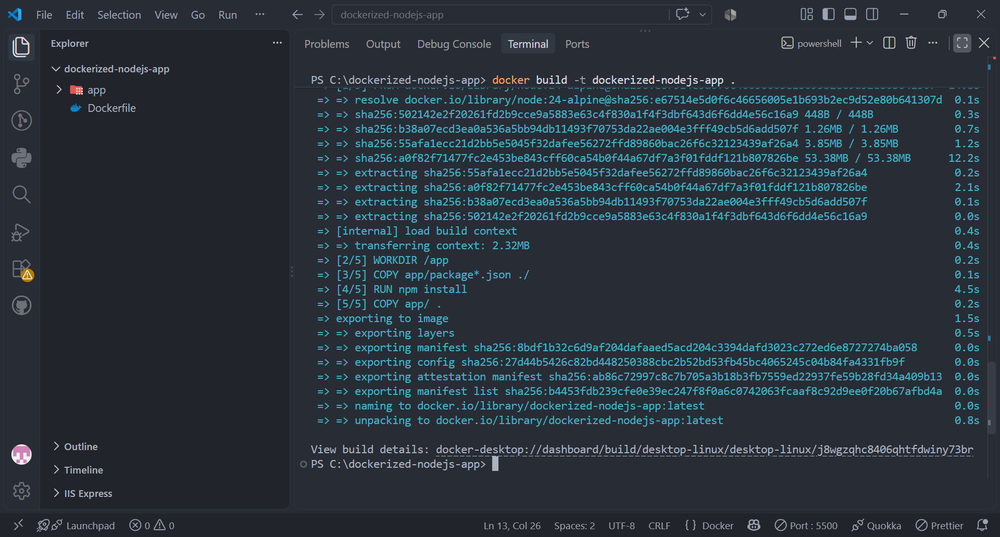
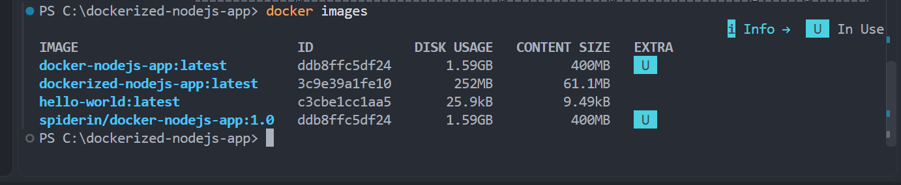
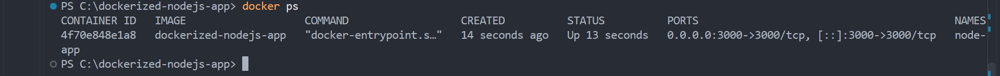
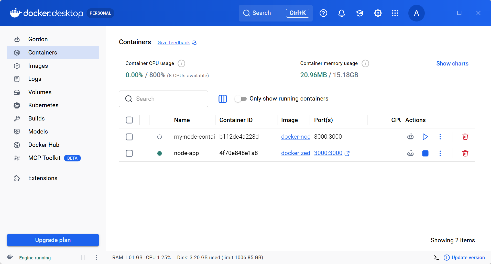
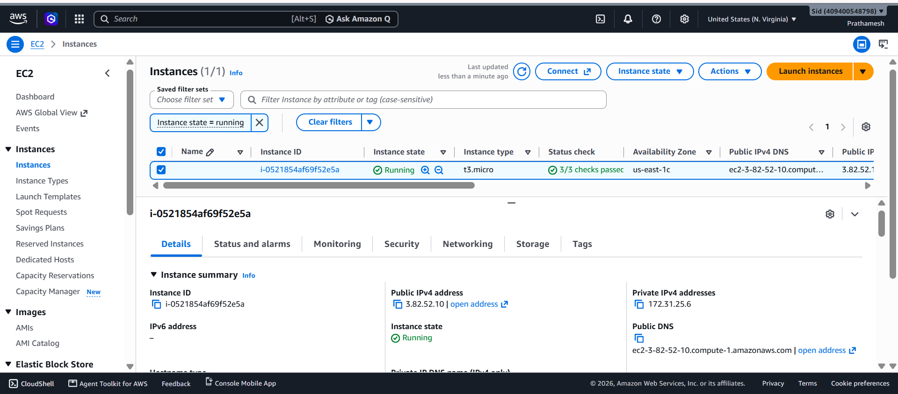
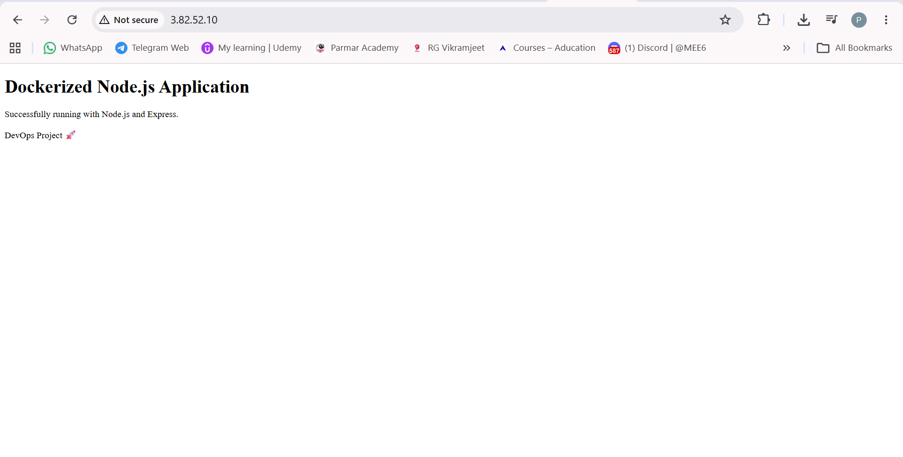

# 🐳 Dockerized Node.js Web Application

A simple Node.js web application containerized using Docker and deployed on an AWS EC2 instance.

## 🚀 Project Overview

This project demonstrates how to:

- Build a Node.js web application using Express
- Create a Docker image using a Dockerfile
- Run the application inside a Docker container
- Push the Docker image to Docker Hub
- Deploy the same Docker image on an AWS EC2 instance
- Access the application through the EC2 public IP

## 🏗️ Architecture

```text
Developer
    │
    ▼
Node.js + Express Application
    │
    ▼
Dockerfile
    │
    ▼
Docker Image
    │
    ├──► Docker Hub
    │
    ▼
AWS EC2
    │
    ▼
Docker Container
    │
    ▼
Web Browser
```

## 🛠️ Technologies Used

- Node.js
- Express.js
- Docker
- Docker Hub
- AWS EC2
- Amazon Linux 2023
- Git
- GitHub

## 📁 Project Structure

```text
dockerized-nodejs-app/
│
├── app/
│   ├── public/
│   │   └── index.html
│   ├── server.js
│   ├── package.json
│   └── package-lock.json
│
├── screenshots/
│
├── Dockerfile
├── .dockerignore
├── .gitignore
└── README.md
```

## 🐳 Docker Setup

### Build the Docker image

```bash
docker build -t dockerized-nodejs-app .
```

### Run the container

```bash
docker run -d -p 3000:3000 --name node-app dockerized-nodejs-app
```

The application can then be accessed at:

```text
http://localhost:3000
```

## 📦 Docker Hub

Docker image:

`alphacr7/dockerized-nodejs-app:latest`

Pull the image using:

```bash
docker pull alphacr7/dockerized-nodejs-app:latest
```

## ☁️ AWS EC2 Deployment

The Docker image was deployed on an AWS EC2 instance running Amazon Linux 2023.

### Pull the Docker image

```bash
docker pull alphacr7/dockerized-nodejs-app:latest
```

### Run the application

```bash
docker run -d -p 80:3000 --name node-app alphacr7/dockerized-nodejs-app:latest
```

Port mapping:

```text
EC2 Port 80 → Container Port 3000
```

The application can then be accessed through the EC2 public IPv4 address.

## 🔐 AWS Security Group

The EC2 Security Group was configured with:

| Protocol | Port | Source    |
| -------- | ---: | --------- |
| SSH      |   22 | My IP     |
| HTTP     |   80 | 0.0.0.0/0 |

Port 3000 was not exposed publicly because the application is accessed through HTTP port 80.

## 📸 Screenshots

### Docker Build



### Docker Image



### Docker Container



### Docker Hub



### AWS EC2 Instance



### Live Application



## 🎯 What I Learned

Through this project, I gained hands-on experience with:

- Docker images and containers
- Dockerfile creation
- Docker port mapping
- Docker Hub
- Linux commands
- AWS EC2
- AWS Security Groups
- Deploying containerized applications
- Git and GitHub
- Basic cloud deployment workflow

## 🔄 Deployment Workflow

```text
Write Application
       ↓
Create Dockerfile
       ↓
Build Docker Image
       ↓
Run Container Locally
       ↓
Push Image to Docker Hub
       ↓
Launch AWS EC2
       ↓
Install Docker
       ↓
Pull Docker Image
       ↓
Run Container
       ↓
Access Application
```

## 👨‍💻 Author

**Prathamesh**

DevOps & Cloud Enthusiast | AWS Certified Cloud Practitioner
